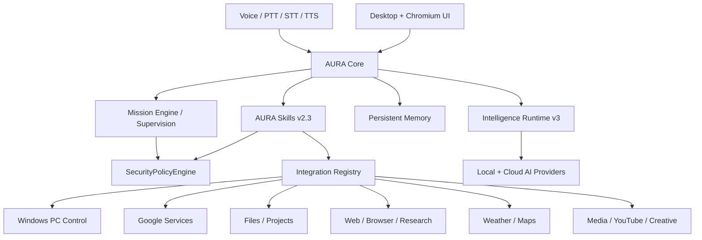

<div align="center">


### Local-first AI for Windows

**Voice · Memory · Secure Desktop Control · Connected Services · Developer Fabric**

<br>


<br><br>

<a href="#features">Features</a> ·
<a href="#architecture">Architecture</a> ·
<a href="#security--privacy">Security</a> ·
<a href="#configuration">Configuration</a> ·
<a href="#development--testing">Development</a>

</div>

---

## Overview

**AURA** is a Windows AI assistant built around a local-first architecture, explicit user control and modular capabilities.

It combines conversational AI, local memory, voice, files, research, weather, navigation, productivity, connected accounts, Windows orchestration, media, creative workflows and supervised multi-step automation behind a single desktop experience.

The project is designed around four principles:

- **Local-first by default** — local storage, local memory, local voice paths and local project intelligence are preferred whenever practical.
- **Explicit control** — sensitive actions are permission-gated, destructive actions fail closed, and microphone capture is push-to-talk only.
- **Provider independence** — the intelligence runtime can route across local and cloud providers instead of binding AURA to one model vendor.
- **Recoverable execution** — supervised plans, receipts, idempotency, backups and rollback are built into high-impact workflows.

> **Repository license:** this source is publicly visible, but it is **not open source**. See [LICENSE](LICENSE).

---

## Features

### Intelligence Runtime v3

AURA's modern intelligence layer is designed as a provider-neutral runtime rather than a single-model wrapper.

- Capability-aware model and provider routing
- Ordered failover across configured providers
- Provider health and reliability tracking
- Model-switch gating and routing policy
- Hardware capability awareness
- Local/cloud policy separation
- Provider-neutral execution contracts
- Conversation route adaptation
- Decision tracing and explainability foundations
- Support for locally hosted models alongside remote APIs
- Configuration hooks for OpenAI, Anthropic, Groq, Gemini, Mistral, DeepSeek, xAI, OpenRouter, Cohere, Together, Perplexity and Ollama

Relevant source:
- `runtime/aura_intelligence_gateway_v3.py`
- `runtime/aura_model_policy_engine_v3.py`
- `runtime/aura_provider_health_registry_v3.py`
- `runtime/aura_model_switch_gate_v3.py`
- `runtime/aura_v3_conversation_route_adapter.py`

---

### Conversation & Product UI

AURA includes both native desktop components and a Chromium-based product surface.

- Main conversational workspace
- Text interaction
- Attached-document routing
- Structured Personal Results
- Memory workspace
- Tasks and agenda workspaces
- Modules workspace
- AURA Live / runtime status surfaces
- Diagnostics
- Settings
- Skills Center
- Developer-mode surfaces
- Weather and map workspaces
- Responsive Chromium UI
- FR / EN localization framework
- Persisted locale handling
- Product-status projection
- Accessibility and motion-control layers

Current Chromium application surface:

`ui/chromium/v0.7.2.2-rc4.2/`

---

### AURA Skills v2.3

The Skills layer exposes stable capability contracts above the underlying runtime.

Current foundation skills include:

| Skill | Scope |
|---|---|
| **Research** | Search and research workflows |
| **Weather** | Forecast, environmental and map-weather data |
| **Navigation** | Location and route workflows |
| **Files** | Authorized file and project intelligence |
| **Productivity** | Tasks, reminders and productivity actions |
| **Memory** | Recall, search and controlled memory operations |
| **System** | Policy-gated Windows/system actions |
| **Voice** | Speech output and voice actions |
| **Developer** | Developer workspace and coding workflows |

Microphone start/stop and message transport remain explicit transport concerns outside the Skills layer.

---

### Voice & Speech

AURA supports a modular voice stack with local-first speech paths.

- Explicit **push-to-talk / button-only microphone**
- No continuous listening
- No wake-word requirement
- Microphone opens only from explicit user interaction
- Local STT architecture using Faster-Whisper paths
- Piper TTS support
- XTTS integration
- Chatterbox integration
- User-selectable voice configuration
- Language and voice identity handled separately
- Speech interruption: pressing push-to-talk can stop current TTS before listening
- Local voice model / GPU diagnostics
- CPU/GPU setup and fallback tooling
- Private developer voice samples excluded from the public repository

**Microphone policy:** AURA does **not** keep the microphone permanently active.

See [docs/voice_v05.md](docs/voice_v05.md) and [docs/USER_CONFIGURATION.md](docs/USER_CONFIGURATION.md).

---

### Persistent Memory & Continuity

AURA includes a local memory architecture intended to preserve useful context without turning every conversation into permanent storage.

- Local SQLite-backed memory
- Context retrieval
- Relevance-based recall
- Provenance tracking
- Sensitive-memory filtering
- Private-session mode
- Explicit memory deletion / forgetting
- Session continuity metadata
- Relationship/familiarity UX signal
- Controlled memory injection into conversations
- Explainable memory foundations

The memory layer is local-first and is designed to keep sensitive information out of automatic context unless explicitly allowed.

See [docs/memory_v060.md](docs/memory_v060.md).

---

### Controlled Continuous Learning

AURA can propose new durable knowledge without silently rewriting itself.

- Provenance-aware learning candidates
- Persistent candidate store
- Duplicate detection
- Conflict detection
- Explicit approval requirement
- Conflict review and resolution
- Controlled consolidation into memory
- Audit trail
- No silent model-weight mutation
- No silent self-modification

The learning system distinguishes **candidate knowledge** from **approved consolidated memory**.

See [docs/L170_LIVE_ACCEPTANCE.md](docs/L170_LIVE_ACCEPTANCE.md).

---

### Web Research & Browser Workflows

AURA contains dedicated research and browser layers.

- Explicit web-search routing
- Internet research tools
- Safe HTTP client boundaries
- Search-intent detection
- Browser workflow engine
- Browser provider integration
- Web-fetch tooling
- Grounded source handling foundations
- Research Skill integration
- Personal Results presentation for structured web output

Web activity remains separate from local deterministic actions so local work does not unnecessarily depend on remote providers.

---

### Weather & Environmental Intelligence

AURA's weather workspace uses live geospatial data rather than static summaries.

- Place geocoding
- Current weather
- Forecast data
- Temperature
- Precipitation probability
- Wind speed and direction
- Wind gusts
- Cloud cover
- Atmospheric pressure
- Air-quality data
- European AQI
- PM2.5 / PM10
- Regional sampled forecast fields
- Map-oriented weather visualization data
- Weather-aware workspace integration

Current weather tooling uses Open-Meteo services.

Relevant source: [tools/weather.py](tools/weather.py)

---

### Maps, Routing & Navigation

AURA includes controlled mapping and route planning.

- Place lookup and geocoding
- Origin/destination routing
- Driving-route calculation
- Route geometry
- Distance calculation
- Estimated travel duration
- Map-route visualization data
- Open-Meteo geocoding
- OSRM routing
- Google Maps handoff URLs
- Navigation workspace integration
- Route-aware UI surfaces

Relevant source: [tools/maps.py](tools/maps.py)

---

### Files, Documents & Local Project Intelligence

AURA can work with user-authorized local files without granting unrestricted filesystem access.

- Explicit authorized-folder model
- Authorized file reading
- Authorized file analysis
- Authorized project analysis
- Document attachment workflows
- Local document extraction / analysis
- Deterministic multi-file project summaries
- Cross-file search
- Context extraction
- Provenance per source file
- Bounded local processing
- Local-only project intelligence path
- File Skill integration

The local project engine is provider-free and performs bounded analysis on text already authorized by the system layer.

Relevant source:
- `services/document_analysis.py`
- `services/local_project_intelligence.py`

---

### Productivity

AURA includes native productivity modules and integration contracts.

- Notes
- Tasks
- Reminders
- Reminder parsing
- Scheduler
- Calendar workflows
- Agenda workspace
- Productivity Personal Results
- Date-only vs timed reminder classification
- Task/calendar synchronization logic
- Conflict-state handling
- Canonical action receipts

---

### Google Connected Services

When a Google account is connected and authorized, AURA includes runtime bridges for:

- Email
- Calendar
- Contacts
- Files
- Tasks

The Google runtime is built around replaceable providers and permission-aware integration contracts.

Relevant source:
- `runtime/google_personal_integrations_bridge_v121.py`
- `runtime/google_productivity_sync_v123.py`
- `integrations/google/`

---

### Notifications & Connected Accounts

AURA includes modular infrastructure for:

- Connected-account registration
- Integration permission handling
- Notifications
- Provider registries
- Typed Personal Results
- Action receipts
- Cross-process result transport
- Runtime integration binding

---

### Windows PC Control

AURA can perform bounded Windows orchestration through a security-controlled provider.

Validated capabilities include:

- Enumerate visible Windows
- Query foreground window
- Focus a window
- Minimize a window
- Maximize a window
- Safe application launching
- Authorized-folder actions
- Authorized-file reading and analysis
- Authorized-project analysis
- Structured Windows Personal Results

Destructive actions such as arbitrary process termination or uncontrolled window closing are not treated as default-safe operations.

See [docs/W131_LIVE_ACCEPTANCE.md](docs/W131_LIVE_ACCEPTANCE.md).

---

### Supervised Missions & Recoverable Automation

AURA contains a mission and supervision architecture for multi-step work.

- Mission engine
- Dependency-aware task plans
- Read-only / reversible / mutating / destructive risk tiers
- Policy assessment before execution
- Explicit approval grants
- Action receipts
- Idempotent execution
- Crash-recovery journal
- Persistent mission state
- Supervised-session registry
- Recovery before new mutation
- Reversible preimage restoration
- Fail-closed destructive-action policy
- No automatic confirmation after restart
- No autonomous destructive execution

AURA's automation model is intentionally **supervised**, not unrestricted.

Relevant source:
- `mission_engine/`
- `runtime/aura_autonomous_supervisor_v200.py`
- `runtime/aura_persistent_runtime_bootstrap_v200.py`

---

### Music & Media Center

AURA includes a local media layer.

- Local media indexing
- Media-library browsing
- Controlled playback
- VLC-backed player integration
- Playback status
- Media collections
- Playlist state
- Resume state
- Windows media-key integration
- Media UI synchronization
- Explicit confirmation model for controlled playback actions

See [docs/M180_LIVE_ACCEPTANCE.md](docs/M180_LIVE_ACCEPTANCE.md).

---

### YouTube Studio Copilot

AURA includes a YouTube analytics and publishing-workflow assistant.

Analytics capabilities include:

- Channel summary
- Subscriber and view trends
- Video counts
- Retention analysis
- Top-video analysis
- Shorts vs long-form comparison
- Publishing-window analysis
- Editorial-mix analysis
- Explainable recommendation scoring

Publishing workflow capabilities include:

- Draft publishing workflows
- Local persisted workflow state
- Explicit approval gates
- Workflow status tracking

The currently documented YouTube integration is intentionally safe:

- direct upload: disabled
- direct edit: disabled
- direct delete: disabled
- direct comment reply: disabled
- external publishing mutation: disabled

See:
- [docs/Y150_LIVE_ACCEPTANCE.md](docs/Y150_LIVE_ACCEPTANCE.md)
- [docs/Y151_LIVE_ACCEPTANCE.md](docs/Y151_LIVE_ACCEPTANCE.md)

---

### Obsidian Creative Studio

AURA includes read-only creative-project integration for Obsidian vaults.

- Vault indexing
- Note search
- Category routing
- Character/context lookup
- Typed Obsidian Personal Results
- Read-only policy
- No automatic note writes
- No automatic note deletion

See [docs/O140_LIVE_ACCEPTANCE.md](docs/O140_LIVE_ACCEPTANCE.md).

---

### Long-form Writing & Revision Intelligence

The long-form layer extends project context into manuscript-level assistance.

- Manuscript outline
- Previous/current/next chapter context
- Continuity audit
- Chapter revision brief
- Chapter transition analysis
- Chapter revision report
- Manuscript revision report
- Read-only Obsidian integration
- Natural-language long-form routes

See [docs/O141_LIVE_ACCEPTANCE.md](docs/O141_LIVE_ACCEPTANCE.md).

---

### Developer Fabric

AURA Developer Fabric is a supervised coding and repository-workflow system integrated into AURA.

Core capabilities include:

- Repository/workspace boundaries
- Provider/model registry
- Capability-aware model routing
- Provider health, reliability and latency signals
- Circuit breaking
- Ordered failover
- Local/cloud policy
- Cost ceilings and budget policy foundations
- Context construction
- Planning
- Patch proposal
- Tests
- Diff generation
- Explicit approval before write
- Transactional backup
- Rollback
- Audit receipts
- Native developer workspace integration

The repository also includes launcher integrations for:

- Claude Code
- Codex
- Pi
- OpenCode
- Cline
- Hermes
- DeepSeek Harness
- Grok Build
- Muse Code
- Aider

See [docs/AURA_DEVELOPER_FABRIC_NATIVE_GATEWAY_ARCHITECTURE.md](docs/AURA_DEVELOPER_FABRIC_NATIVE_GATEWAY_ARCHITECTURE.md).

---

### Health & Wearable Integration Tooling

The repository contains H185 validation / ingest tooling for privacy-conscious Apple Health interoperability workflows.

- Authenticated iPhone validation flow
- Private-LAN validation tooling
- Tailscale validation tooling
- Local vitals snapshot validation
- Health field recognition without printing numeric health values into validation logs
- Health data kept outside the public Git repository

This area is deployment-specific: personal health payloads, tokens, pairing files and runtime snapshots are intentionally excluded from Git.

---

### Localization

AURA contains a bilingual localization framework for:

- French
- English

The localization layer covers product labels, persisted locale state and language-aware runtime/voice integration paths.

Some historical subsystem documents still contain milestone-era French labels because they are preserved as development evidence.

---

### Profile Portability

AURA includes profile portability tooling.

- Profile export
- Import preview
- Confirmed profile import
- Rollback support
- Secrets excluded from exported profiles
- CLI tooling
- GUI/onboarding integration foundations

Relevant source:
- `aura_profile_portability.py`
- `aura_profile_cli.py`

---

## Architecture



### Core execution principle

Sensitive actions are not delegated directly to an LLM.

AURA separates **language understanding** from **authorization and execution**:

```text
User request
    ↓
Intent / Conversation routing
    ↓
Skill / Runtime planning
    ↓
SecurityPolicyEngine
    ↓
Integration / Module / Provider
    ↓
ActionReceipt / Result
    ↓
AURA UI / Voice response
```

---

## Security & Privacy

Security is an architectural boundary, not only a prompt instruction.

AURA includes:

- Fail-closed unknown actions
- Explicit permissions
- Risk classification
- Security audit records
- Secret redaction in logging paths
- Authorized-folder boundaries
- Explicit approval for sensitive mutations
- Action receipts
- Recovery and rollback foundations
- Private/local memory design
- No real credentials in the public repository
- No private voice samples in the public repository
- No personal runtime state in the public repository
- No model binaries in the public repository

### Microphone privacy

AURA intentionally does **not** use an always-on microphone.

Microphone capture starts only through explicit user interaction with the push-to-talk control.

### Credentials

Each user supplies their own provider credentials locally.

Never commit:

- `.env`
- API keys
- OAuth tokens
- refresh/access tokens
- cookies or browser sessions
- private voice references
- personal memory databases
- runtime state
- local media indexes
- authorized-folder lists

Use [`.env.example`](.env.example) as the public template.

See [SECURITY.md](SECURITY.md).

---

## Configuration

The public configuration template currently exposes blank provider entries for:

```text
OpenAI
Anthropic
Groq
Gemini
Mistral
DeepSeek
xAI
OpenRouter
Cohere
Together
Perplexity
Ollama
```

Voice configuration is also local and user-selectable.

Public template:

[`.env.example`](.env.example)

User configuration notes:

[docs/USER_CONFIGURATION.md](docs/USER_CONFIGURATION.md)

---

## Models

Large AI, STT and TTS binaries are intentionally **not committed to Git**.

Model metadata and setup logic may be present in the repository, while model weights must be provisioned separately.

This keeps the repository small, reproducible and free from machine-specific assets.

---

## Source / Development Setup

This repository is currently best treated as a **source/development distribution**.

The standalone clean-Windows installer line is not presented as a fully certified public release yet.

The repository includes:

- `requirements.txt`
- specialized requirements profiles
- voice requirements
- XTTS setup tooling
- environment verification
- Windows batch launchers
- diagnostic scripts
- CI lanes
- cold-install verification tooling

Main launcher:

`RUN_AURA.bat`

Voice / optional subsystem setup scripts are available at the repository root and under `tools/bat/`.

> Review configuration, hardware requirements and local provider setup before starting AURA on a new machine.

---

## Repository Structure

| Path | Purpose |
|---|---|
| `core/` | Core orchestration, event bus, intents, routing and product identity |
| `runtime/` | Runtime v3, mission supervision, providers and feature bindings |
| `skills/` | Skills registry, manifests and handlers |
| `voice/` | Voice engine, microphone, XTTS, Chatterbox and voice helpers |
| `memory/` | Memory, continuity, learning and relationship layers |
| `security/` | Policy engine, risk controls and audit |
| `mission_engine/` | Mission/task graph and supervised execution foundations |
| `integrations/` | Google, browser, media, files, productivity and other providers |
| `services/` | Document analysis, local project intelligence and shared services |
| `tools/` | Weather, maps, web, search and utility tools |
| `modules/` | Notes, tasks and reminders |
| `ui/` | Native desktop and Chromium application surfaces |
| `agent/` | Planning/orchestration agent components |
| `ai/` | Response, speech and routing intelligence helpers |
| `action_receipts/` | Canonical action traceability |
| `ci/` | Fast/full CI lanes and invariant manifests |
| `tests/` | Regression, invariant, integration and product tests |
| `docs/` | Architecture, subsystem and acceptance documentation |
| `launchers/` | Developer Fabric coding-agent launchers |

---

## Development & Testing

AURA contains a large regression and invariant test suite.

Coverage includes, among other areas:

- Security fail-closed behavior
- Memory
- Voice
- Microphone selection
- Maps
- Weather
- Browser routing
- Google connected services
- Windows PC control
- Mission supervision
- Crash recovery
- Developer Fabric
- Model routing
- Provider failover
- Skills
- UI/runtime contracts
- YouTube analytics
- Obsidian / long-form workflows
- Controlled learning

CI configuration:

[`.github/workflows/aura-ci.yml`](.github/workflows/aura-ci.yml)

The workflow defines:

- Windows-based fast lane
- Environment verification
- Manual / scheduled full smoke lane
- CI report artifacts

---

## Product Status

| Component | Current public line |
|---|---|
| **AURA product** | v2.3 |
| **Intelligence Runtime** | v3 |
| **Skills** | v2.3 |
| **Chromium UI** | 0.7.2.2-rc4.2 |
| **Repository branch** | `main` |
| **Platform** | Windows |
| **Microphone policy** | Push-to-talk / button only |
| **License** | All Rights Reserved |

The source tree contains historical milestone identifiers and compatibility files from earlier AURA generations. Those subsystem identifiers are preserved where they remain useful for compatibility, tests or engineering evidence and should not be interpreted as the global product version.

---

## Roadmap

Current product work is focused on the modern v2.x architecture.

Near-term areas include:

- Runtime and metadata consolidation
- Product Command Center evolution
- Documentation consolidation
- Clean architecture work
- Public installation / onboarding hardening
- Continued provider and integration hardening

The repository intentionally separates current product code from private runtime data and machine-specific configuration.

---

## License

**AURA is proprietary software.**

Copyright © 2026 **Veyr**. All Rights Reserved.

Public availability of this repository does **not** grant permission to copy, modify, distribute, sublicense, sell or reuse AURA or substantial portions of its source code without prior written authorization.

See [LICENSE](LICENSE) for the complete terms.

---

<p align="center">
  <strong>AURA — local intelligence, explicit control, recoverable execution.</strong>
</p>
